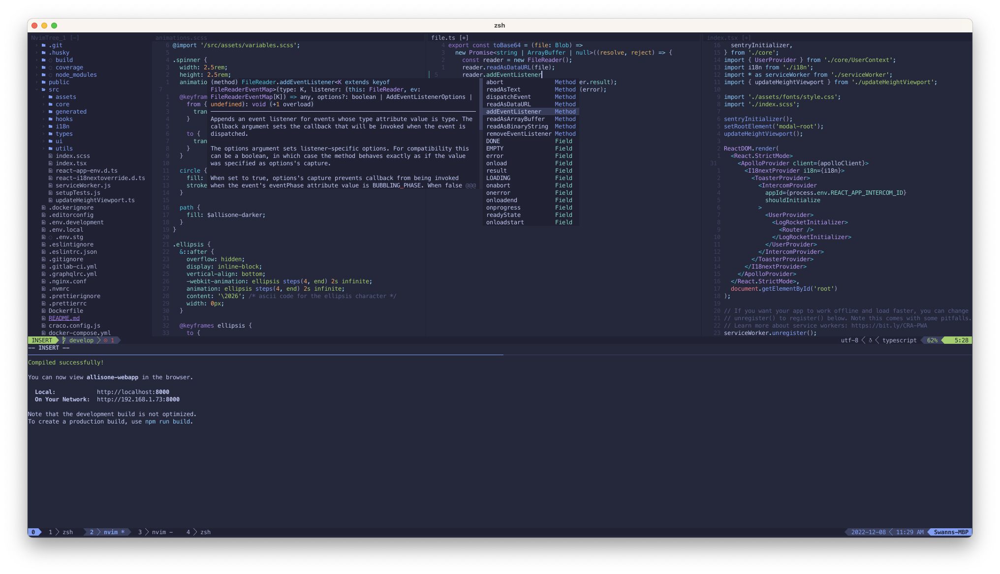

# Dotfiles



## Prerequisites

### Ubuntu / Debian

```bash
sudo add-apt-repository ppa:neovim-ppa/stable
sudo apt update
sudo apt install curl git neovim zsh tmux fonts-powerline
```

[Color theme for GNOME terminal](https://github.com/arcticicestudio/nord-gnome-terminal#installation)

## Installation

```bash
git clone https://github.com/swanncastel/dotfiles.git ~/.dotfiles
cd ~/.dotfiles && ./bootstrap.sh -is
```

[Follow ycm instructions](https://github.com/ycm-core/YouCompleteMe#linux-64-bit)

To use fzf outside of Vim
`~/.fzf/install`

## TODO

* Key bindings for ycm GoTo, Refacto, FixIt...
