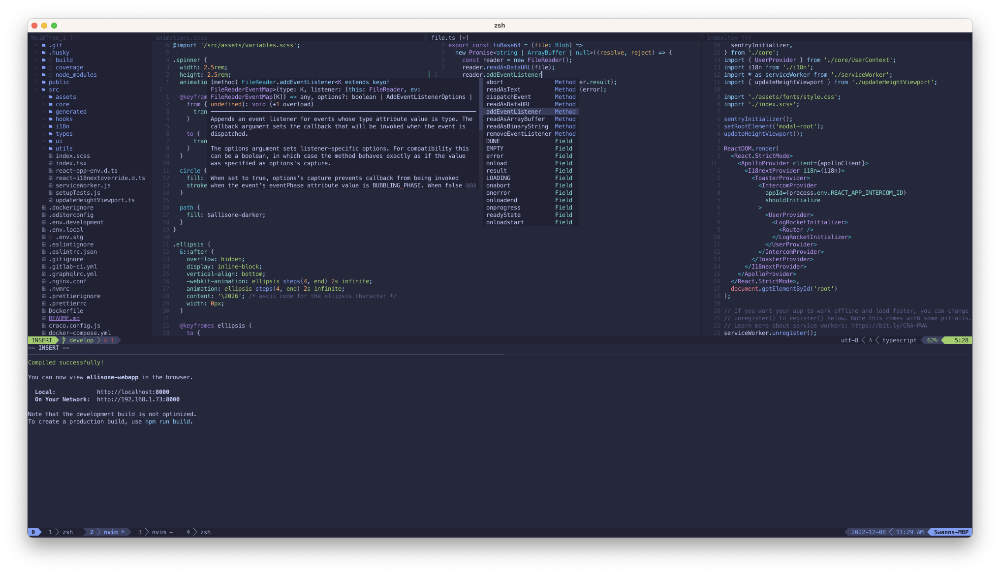

# Dotfiles



## Prerequisites

### Ubuntu

```bash
# required
sudo apt install curl git neovim zsh tmux stow ripgrep fzf
# tooling
sudo apt install git-delta bat eza zoxide gh
curl -sS https://starship.rs/install.sh | sh
# terminal emulator
sudo apt install kitty alacritty
```

> Ubuntu ships `bat` as `batcat`: `ln -s /usr/bin/batcat ~/.local/bin/bat`

### Arch based

```bash
# required
sudo pacman -S curl git neovim zsh tmux stow ripgrep fzf
# tooling
sudo pacman -S git-delta bat eza zoxide github-cli starship
# terminal emulator
sudo pacman -S kitty alacritty
```

### MacOS

> Install brew https://docs.brew.sh/Installation

```bash
# required
brew install curl git neovim zsh tmux stow ripgrep fzf
# for fzf tab completion
brew install gawk grep gnu-sed coreutils
# tooling
brew install git-delta bat eza zoxide gh starship rtk
# terminal emulator and font
brew install --cask kitty alacritty font-jetbrains-mono-nerd-font
```

### Linux

Install [rtk](https://github.com/rtk-ai/rtk#installation), used by the Claude Code hook to compact command output.

## Installation

```bash
bash -c "$(curl -fsSL https://raw.githubusercontent.com/cr4ftx/dotfiles/main/install.sh)"
# or custom destination dir
bash -c "DOTFILES_DIR=[PATH_FOLDER] $(curl -fsSL https://raw.githubusercontent.com/cr4ftx/dotfiles/main/install.sh)"
# for bat custom theme
bat cache --build
```
