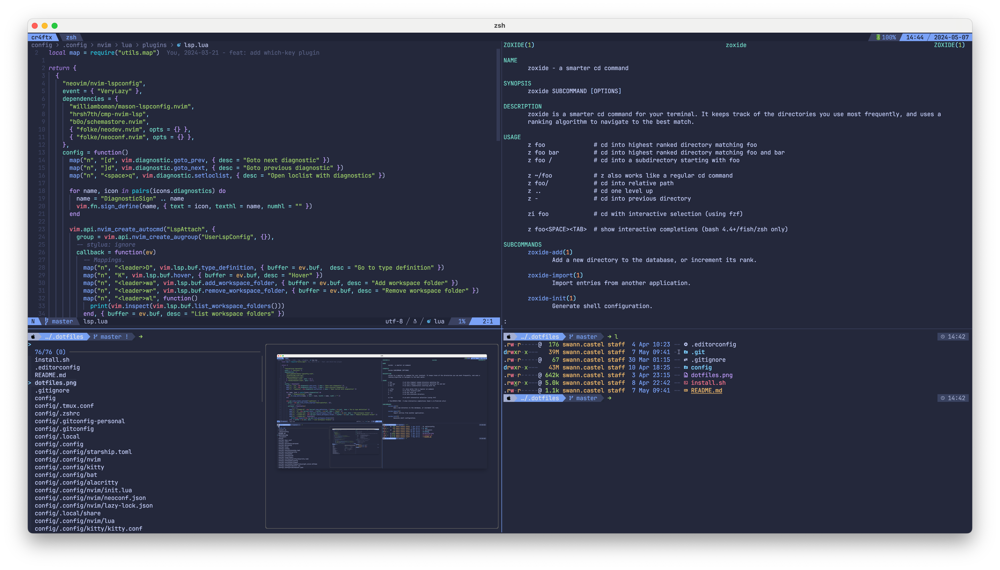

# Dotfiles



## Prerequisites

### Ubuntu

```bash
sudo add-apt-repository ppa:mmstick76/kitty
sudo apt update
sudo apt install git-delta bat eza starship
sudo apt install kitty
sudo apt install alacritty
sudo apt install curl git neovim zsh tmux stow ripgrep
```

### Arch based

```bash
sudo pacman -S git-delta bat eza starship
sudo pacman -S kitty
sudo pacman -S alacritty
sudo pacman -S curl git neovim zsh tmux stow ripgrep
```

### MacOS

> Install brew https://docs.brew.sh/Installation

```bash
# for fzf tab completion
brew install gawk grep gnu-sed coreutils
# tooling
brew install git-delta bat eza starship
# better terminal emulator
brew install kitty
brew install alacritty
# required
brew install curl git neovim zsh tmux stow ripgrep fzf
```

## Installation

```bash
bash -c "$(curl -fsSL https://raw.githubusercontent.com/cr4ftx/dotfiles/master/install.sh)"
# or custom destination dir
bash -c "DOTFILES_DIR=[PATH_FOLDER] $(curl -fsSL https://raw.githubusercontent.com/cr4ftx/dotfiles/master/install.sh)"
# for bat custom theme
bat cache --build
```
